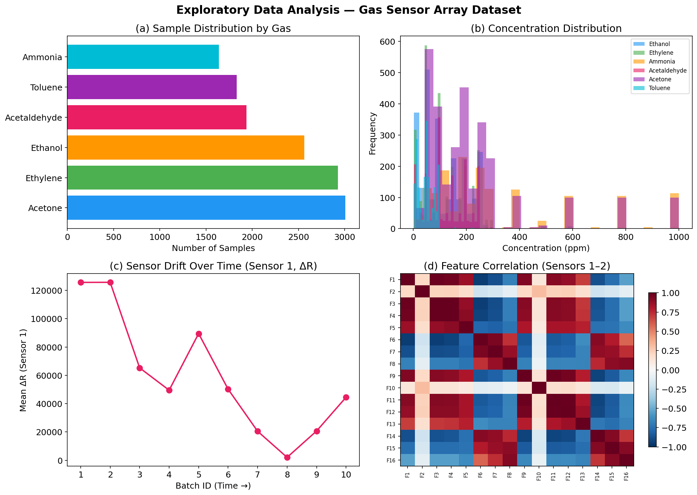

<div align="center">

# Physics-Informed Neural Network for Gas Sensor Analysis

**Multi-Task PINN for Simultaneous Gas Classification & Concentration Prediction with Drift Compensation**

[](https://python.org)
[](https://pytorch.org)
[](LICENSE)
[](https://colab.research.google.com/)

</div>

---

## Abstract

Metal oxide semiconductor (MOS) gas sensor arrays are widely used in environmental monitoring, industrial safety, and medical diagnostics. However, these sensors suffer from **temporal drift**, a gradual degradation in response characteristics over time, which compromises classification accuracy and concentration estimation in long-term deployments.

This project presents a **Physics-Informed Neural Network (PINN)** that addresses sensor drift by embedding three domain-specific physical constraints directly into the training loss function. The model simultaneously performs:

1. **Gas Classification**: identifying 6 target gases (Ethanol, Ethylene, Ammonia, Acetaldehyde, Acetone, Toluene)
2. **Concentration Regression**: predicting gas concentration in ppm from sensor array responses

By integrating physical priors (sensor response consistency, exponential moving average monotonicity, and temporal drift smoothness), the PINN achieves robust performance across 36 months of experimental data comprising **13,910 measurements** from 16 chemical sensors.

---

## Dataset

This project uses the **Gas Sensor Array Drift at Different Concentrations** dataset from the [UCI Machine Learning Repository](https://archive.ics.uci.edu/dataset/270/gas+sensor+array+drift+dataset+at+different+concentrations).

| Property | Details |
|:---|:---|
| **Source** | ChemoSignals Laboratory, BioCircuits Institute, UC San Diego |
| **Duration** | January 2008 – February 2011 (36 months) |
| **Samples** | 13,910 measurements |
| **Sensors** | 16 metal oxide chemical sensors |
| **Features** | 128 (8 features × 16 sensors) |
| **Target Gases** | Ethanol, Ethylene, Ammonia, Acetaldehyde, Acetone, Toluene |
| **Concentration Range** | 5 – 1,000 ppmv |
| **Batches** | 10 (grouped by recording month for drift analysis) |

### Feature Description

For each of the 16 sensors, 8 features are extracted:

| Feature | Symbol | Description |
|:---|:---|:---|
| Steady-state response | ΔR | Maximal resistance change from baseline |
| Normalized response | \|ΔR\| | ΔR normalized by baseline resistance |
| Rising EMA (α=0.001) | EMAi₀.₀₀₁ | Exponential moving average of rising transient (slow) |
| Rising EMA (α=0.01) | EMAi₀.₀₁ | Exponential moving average of rising transient (medium) |
| Rising EMA (α=0.1) | EMAi₀.₁ | Exponential moving average of rising transient (fast) |
| Decaying EMA (α=0.001) | EMAd₀.₀₀₁ | Exponential moving average of decaying transient (slow) |
| Decaying EMA (α=0.01) | EMAd₀.₀₁ | Exponential moving average of decaying transient (medium) |
| Decaying EMA (α=0.1) | EMAd₀.₁ | Exponential moving average of decaying transient (fast) |

The EMA transformation is defined as:

$$y[k] = (1 - \alpha) \cdot y[k-1] + \alpha \cdot (R[k] - R[k-1])$$

where $R[k]$ is the sensor resistance at time step $k$ and $\alpha$ is the smoothing parameter.

---

## Model Architecture

The model uses a **multi-task architecture** with a shared feature extraction backbone and two task-specific heads:

```
Input (128 features)
       │
       ▼
┌──────────────────────┐
│   Shared Backbone    │
│                      │
│  Linear(128 → 256)   │
│  BatchNorm → ReLU    │
│  Dropout(0.3)        │
│                      │
│  Linear(256 → 128)   │
│  BatchNorm → ReLU    │
│  Dropout(0.3)        │
│                      │
│  Linear(128 → 64)    │
│  BatchNorm → ReLU    │
└──────┬───────┬───────┘
       │       │
       ▼       ▼
┌────────┐ ┌────────────┐
│Classif.│ │ Regression │
│ Head   │ │   Head     │
│        │ │            │
│ 64→32  │ │  64→32     │
│ ReLU   │ │  ReLU      │
│ Drop   │ │  Drop      │
│ 32→6   │ │  32→1      │
└────────┘ └────────────┘
  Gas ID    Concentration
 (6-class)     (ppm)
```

### Physics-Informed Loss Function

The total loss is a weighted combination of data-driven and physics-informed terms:

$$\mathcal{L}_{\text{total}} = \mathcal{L}_{\text{classification}} + 0.5 \cdot \mathcal{L}_{\text{regression}} + \lambda_1 \mathcal{L}_{\text{consistency}} + \lambda_2 \mathcal{L}_{\text{monotonicity}} + \lambda_3 \mathcal{L}_{\text{drift}}$$

#### Constraint 1 — Sensor Response Consistency

For each sensor $j$, the steady-state feature $\Delta R_j$ and its normalized counterpart $|\Delta R|_j$ must be physically consistent. We penalize cases where they have opposing signs:

$$\mathcal{L}_{\text{consistency}} = \frac{1}{16} \sum_{j=1}^{16} \text{mean}\left[\text{ReLU}\left(-\Delta R_j \cdot |\Delta R|_j\right)\right]$$

#### Constraint 2 — EMA Monotonicity

For each sensor, the EMA features with increasing smoothing parameter $\alpha$ must follow a monotonic ordering — a larger $\alpha$ produces a faster response and correspondingly larger EMA value:

$$\mathcal{L}_{\text{monotonicity}} = \frac{1}{16} \sum_{j=1}^{16} \left[\text{ReLU}(\text{EMA}_{0.001}^j - \text{EMA}_{0.01}^j) + \text{ReLU}(\text{EMA}_{0.01}^j - \text{EMA}_{0.1}^j)\right]$$

#### Constraint 3 — Temporal Drift Smoothness

Learned latent representations from consecutive time batches should vary smoothly. We penalize abrupt jumps in the mean latent vector between consecutive batches:

$$\mathcal{L}_{\text{drift}} = \frac{1}{B-1} \sum_{b=1}^{B-1} \left\| \bar{\mathbf{z}}_{b+1} - \bar{\mathbf{z}}_b \right\|^2$$

where $\bar{\mathbf{z}}_b$ is the mean shared representation for batch $b$.

---

## Results

### Exploratory Data Analysis

<p align="center">
  
</p>

**Key observations:** (a) Ammonia and Ethylene dominate the dataset. (b) Concentration distributions vary significantly per gas. (c) Sensor 1 ΔR exhibits clear drift across batches. (d) Sensor features show strong intra-sensor correlation.

### Model Performance

<p align="center">
  
</p>

| Task | Metric | Value |
|:---|:---|:---|
| **Gas Classification** | Accuracy | **See notebook output** |
| **Gas Classification** | Macro F1-Score | **See notebook output** |
| **Concentration Prediction** | R² Score | **See notebook output** |
| **Concentration Prediction** | MAE | **See notebook output** ppm |
| **Concentration Prediction** | RMSE | **See notebook output** ppm |

> **Note:** Replace "See notebook output" with your actual results after running the notebook.

### SHAP Explainability Analysis

<p align="center">
  
</p>

SHAP (SHapley Additive exPlanations) analysis reveals which sensor features drive the model's predictions. The summary plot above shows the top 20 most influential features, with color indicating feature value (red = high, blue = low).

<p align="center">
  
  
</p>

**Left:** Aggregated importance by sensor, identifies which physical sensors contribute most to gas discrimination.  
**Right:** Aggregated importance by feature type, reveals whether steady-state (ΔR) or dynamic (EMA) features are more informative.

### Drift Analysis

<p align="center">
  
</p>

Classification accuracy is evaluated per batch to assess robustness against sensor drift over the 36-month measurement period. The physics-informed constraints encourage the model to learn drift-invariant representations.

---

---

## Getting Started

### Prerequisites

- Python 3.8+
- Google Colab (recommended) or local environment with GPU

### Option A: Google Colab (Recommended)

1. Open the notebook in Google Colab:

   [](https://colab.research.google.com/)

2. Upload the notebook file from `notebooks/GasSensorPINN.ipynb`

3. Download the dataset from [UCI Machine Learning Repository](https://archive.ics.uci.edu/dataset/270/gas+sensor+array+drift+dataset+at+different+concentrations)

4. Unzip and upload all 10 `.dat` files (`batch1.dat` – `batch10.dat`) when prompted

5. Run all cells sequentially

### Option B: Local Installation

```bash
# Clone the repository
git clone https://github.com/Okohfrank/GasSensorPINN.git
cd GasSensorPINN

# Install dependencies
pip install -r requirements.txt

# Download the dataset from the UCI link above, unzip into data/

# Run the notebook
jupyter notebook notebooks/GasSensorPINN.ipynb
```

### Requirements

```
torch>=2.0.0
numpy>=1.24.0
pandas>=2.0.0
scikit-learn>=1.3.0
matplotlib>=3.7.0
shap>=0.42.0
```

---

## Methodology

### Why Physics-Informed?

Standard neural networks treat sensor data as generic numerical inputs, ignoring the underlying physical processes that generate these signals. This leads to:

- **Overfitting to drift patterns** rather than learning gas-discriminative features
- **Physically implausible predictions** where feature relationships violate known sensor physics
- **Poor generalization** to data from different time periods

Our PINN approach addresses these issues by encoding three domain-specific constraints:

| Constraint | Physical Basis | Effect on Training |
|:---|:---|:---|
| Sensor Consistency | ΔR and \|ΔR\| arise from the same electrochemical process | Prevents the model from exploiting measurement artifacts |
| EMA Monotonicity | Higher α captures faster dynamics → larger feature values | Enforces physically valid feature orderings |
| Drift Smoothness | Sensor degradation is a gradual process, not instantaneous | Encourages drift-invariant latent representations |

### Multi-Task Learning

The shared backbone architecture allows the model to learn representations that are useful for both gas identification and concentration estimation. This joint training:

- Acts as an implicit **regularizer**, reducing overfitting
- Forces the model to capture both **qualitative** (which gas) and **quantitative** (how much) information
- Improves sample efficiency compared to training separate models

---

## References

1. **Vergara, A., Vembu, S., Ayhan, T., Ryan, M.A., Homer, M.L., & Huerta, R.** (2012). Chemical gas sensor drift compensation using classifier ensembles. *Sensors and Actuators B: Chemical*, 166–167, 320–329. [DOI: 10.1016/j.snb.2012.01.074](https://doi.org/10.1016/j.snb.2012.01.074)

2. **Rodríguez-Luján, I., Fonollosa, J., Vergara, A., Homer, M., & Huerta, R.** (2014). On the calibration of sensor arrays for pattern recognition using the minimal number of experiments. *Chemometrics and Intelligent Laboratory Systems*, 130, 123–134. [DOI: 10.1016/j.chemolab.2013.10.012](https://doi.org/10.1016/j.chemolab.2013.10.012)

3. **Vergara, A.** (2012). Gas Sensor Array Drift at Different Concentrations [Dataset]. UCI Machine Learning Repository. [DOI: 10.24432/C5MK6M](https://doi.org/10.24432/C5MK6M)

4. **Raissi, M., Perdikaris, P., & Karniadakis, G.E.** (2019). Physics-informed neural networks: A deep learning framework for solving forward and inverse problems involving nonlinear partial differential equations. *Journal of Computational Physics*, 378, 686–707. [DOI: 10.1016/j.jcp.2018.10.045](https://doi.org/10.1016/j.jcp.2018.10.045)

5. **Lundberg, S.M. & Lee, S.I.** (2017). A Unified Approach to Interpreting Model Predictions. *Advances in Neural Information Processing Systems (NeurIPS)*, 30. [Link](https://proceedings.neurips.cc/paper/2017/hash/8a20a8621978632d76c43dfd28b67767-Abstract.html)

6. **Muezzinoglu, M.K., Vergara, A., Huerta, R., Rulkov, N., Rabinovich, M.I., Selverston, A., & Abarbanel, H.D.I.** (2009). Acceleration of chemo-sensory information processing using transient features. *Sensors and Actuators B: Chemical*, 137(2), 507–512. [DOI: 10.1016/j.snb.2008.10.065](https://doi.org/10.1016/j.snb.2008.10.065)

---

## Citation

If you use this work or find it helpful, please cite:

```bibtex
@misc{gas_sensor_pinn_2026,
  author       = {Okoh Frank},
  title        = {Physics-Informed Neural Network for Gas Sensor Analysis: 
                  Multi-Task Classification and Concentration Prediction 
                  with Drift Compensation},
  year         = {2026},
  publisher    = {GitHub},
  howpublished = {\url{https://github.com/Okohfrank/GasSensorPINN}}
}
```

---

## License

This project is licensed under the MIT License — see the [LICENSE](LICENSE) file for details.

The dataset is provided by the UCI Machine Learning Repository under the [CC BY 4.0](https://creativecommons.org/licenses/by/4.0/) license.

---

<div align="center">

**Built by Okoh Frank**

*Bridging Chemical Engineering and Machine Learning*

</div>
